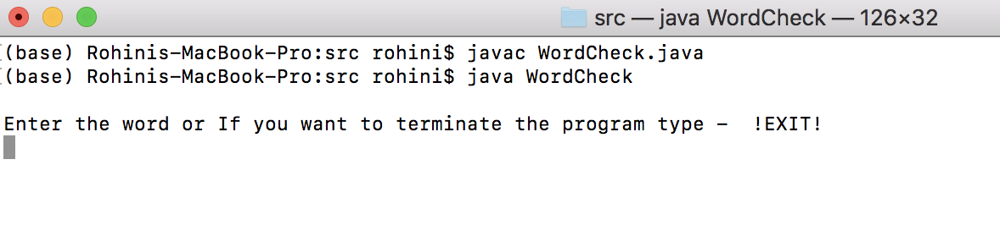
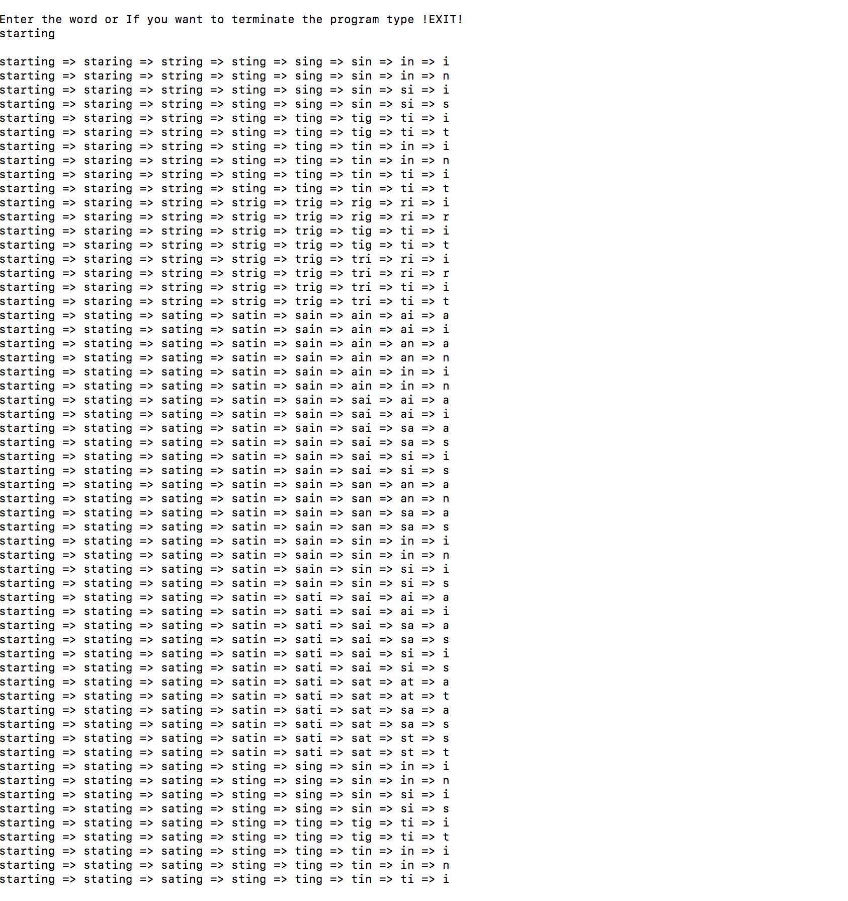

# WordsChain
WordCheck java file running instructions: 

Step 1 : Download the file 

Step 2 : Open the file and add the path of the dictionary in sampe format as I have mention. The location to enter the path is mentioned in the code . Add the new location ,currently it points to local location of my system.

Step 3 : Save the file locally on the system.

Step 4: Open terminal and cd to the path where the WordCheck.java file is stored.

Step 5 : to compile use command -  javac WordCheck.java

Step 6 : To run use command - java WordCheck 

I have added the dictionary here that I have used as a sample input dictionary - english3.txt 

Here is how it looks when ran successfully 

The time complexity is O(n)
